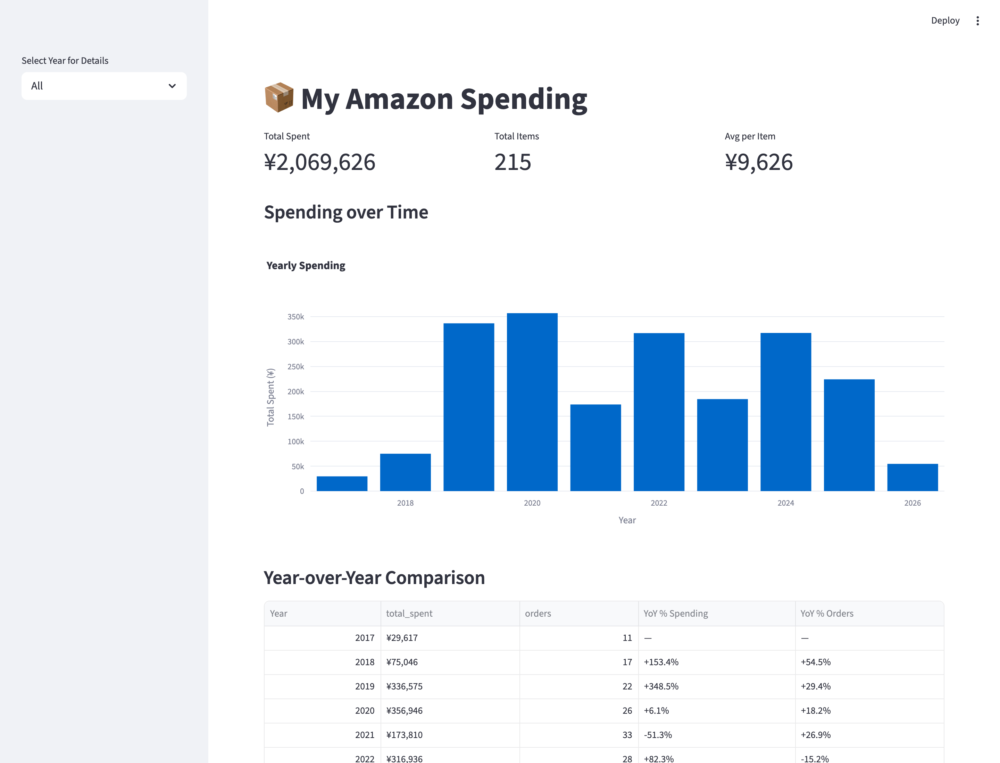

# My Amazon Spending

Streamlit dashboard that reads your Amazon order history CSV export and produces
personal spending analytics — lifetime total, year-over-year comparison,
category breakdown, top products.



> The screenshot above is rendered against synthetic sample data
> (`scripts/gen_sample_orders.py`), not real purchases.

## Get your data

1. Request your data from Amazon's privacy page (works on `.com`, `.co.jp`,
   `.de`, etc.) — pick **"Your Orders"**. Amazon emails you a zip when ready
   (usually within a day).
2. Unzip and put the `Your Orders` folder into this repo as `data/`:

   ```
   ./data/
     Your Amazon Orders/
       Order History.csv           <- what the app reads
       Digital Content Orders.csv  <- not used (see below)
       ...
     Your Returns & Refunds/
     ...
   ```

`data/` is git-ignored — your personal export never leaves your machine.

## Run

With Docker:

```
docker compose up --build
```

With Podman:

```
podman compose up --build
```

Open <http://localhost:8501>.

## What you get

- **Top-line metrics** — total spent, total items, avg per item; year filter in
  the sidebar.
- **Spending over time** — yearly bar chart, or monthly line when a year is
  selected.
- **Year-over-year comparison** — spending and order count with % deltas.
- **Category analysis** — pie charts by category for both spend and order count.
- **Top products** — top 10 by spend and by frequency.
- **Raw data** — collapsible table of the underlying rows.

## Scope

By default the dashboard reads only `Order History.csv` (physical retail
orders), excluding cancelled rows. Toggle **"Include digital content"** in the
sidebar to merge `Digital Content Orders.csv` (Prime renewals, Kindle, Audible,
etc.) — off by default because digital is typically <5% of spend, and the file
splits a single purchase across multiple payment-method rows which inflates the
"Total Items" count.

Refunds live in a separate Amazon file and are not currently subtracted.

## Categories

Categorization is keyword-based and driven by `categories.yaml`. The shipped
file covers ~30 categories with English + Japanese keywords; first match wins,
so put narrower categories above broader ones.

To fit your own purchase mix, edit `categories.yaml` — no code change needed.
Reorder categories to change priority, add languages, or introduce new buckets.
Override the file location with `CATEGORIES_FILE=/path/to/your.yaml`.

If a lot of items still land in "Other", look at the **Raw Data** expander,
filter by `Category = Other`, and either add keywords for the recurring terms
you see or add the relevant product names directly to a category.

## Configuration

| Env var    | Default                    | Purpose                          |
|------------|----------------------------|----------------------------------|
| `DATA_DIR` | `data/Your Amazon Orders`  | Folder containing `Order History.csv`. `docker-compose.yml` overrides this to `/data/Your Amazon Orders` for the bind mount. |

## Regenerating the screenshot

The shipped screenshot uses fake data so no personal info ends up in the repo.
To regenerate after a UI change:

```bash
# 1. Generate sample CSV
python3 scripts/gen_sample_orders.py ".sample-data/Your Amazon Orders/Order History.csv"

# 2. Run a sidecar container against it
podman run --rm -d --name amazon-sample -p 8502:8501 \
  -v "$(pwd)/.sample-data:/data" -v "$(pwd):/app" \
  -e "DATA_DIR=/data/Your Amazon Orders" \
  my-amazon-orders-amazon-analysis

# 3. Capture with Playwright (one-off venv)
python3 -m venv /tmp/pw && /tmp/pw/bin/pip install -q playwright \
  && /tmp/pw/bin/playwright install chromium
/tmp/pw/bin/python scripts/screenshot.py http://localhost:8502 docs/screenshot.png

# 4. Clean up
podman rm -f amazon-sample && rm -rf .sample-data
```

## Tech

Python 3.11 · Streamlit · pandas · Plotly Express.

> Note: pandas 3.x defaults string columns to Arrow-backed `string` dtype rather
> than `object`. Any CSV-cleaning code that branches on `dtype == object` will
> silently no-op. `_normalize_amount()` in `app.py` does the strip
> unconditionally to stay dtype-agnostic.
